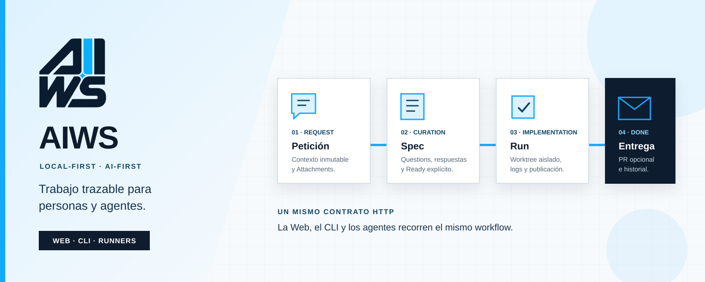
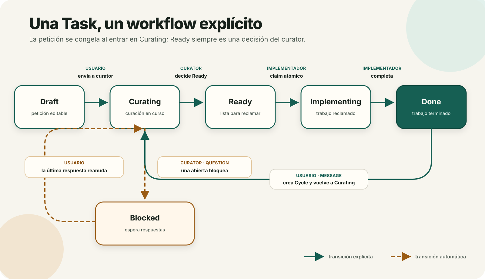
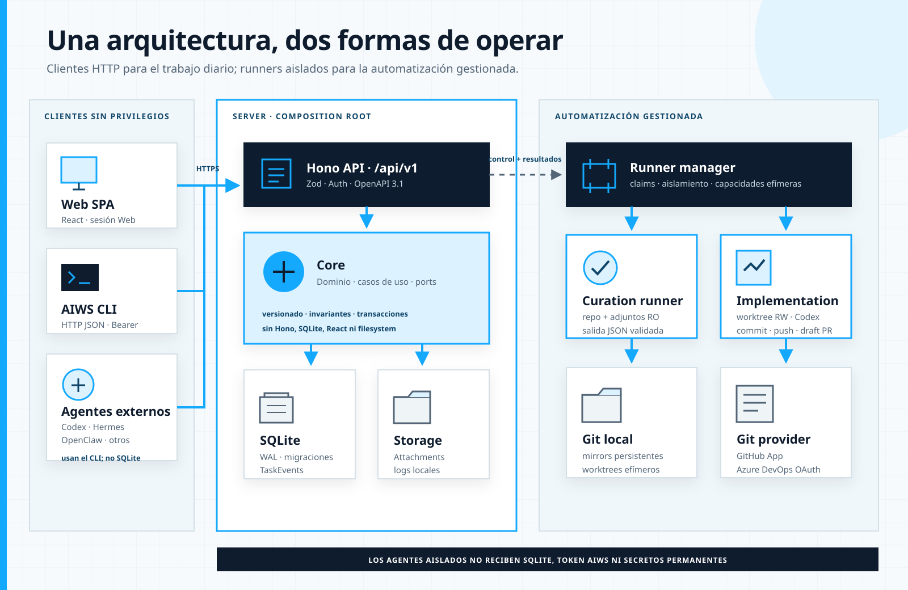

# AIWS v0.8.0

AIWS es un gestor de tareas local y AI-first preparado para que personas y agentes externos trabajen sobre repositorios locales con un workflow seguro y trazable.

AIWS incluye Server/API, SPA Web, CLI HTTP, SQLite, almacenamiento local de adjuntos, Connections
GitHub y Azure DevOps, y ejecución aislada de Codex sobre worktrees de repositorios gestionados. La
baseline MVP v0.1 continúa disponible para Projects locales y agentes externos.

## Empieza aquí

- Operadores: [instalación, HTTPS, health, backup y actualización](./docs/guides/installation.md).
- Administradores de agentes: [runner, Agent Profiles, CLI compartido y skill](./docs/guides/agents.md).
- Administradores Git: [registro de GitHub App y Microsoft Entra](./docs/guides/managed-git-providers.md).
- Usuarios y agentes: [Projects, Tasks, Questions, Cycles, Runs y Activity](./docs/guides/projects-and-tasks.md).
- Agentes CLI: [manual de comandos](./docs/05-cli.md) y
  [skill autocontenida `aiws-workflow`](./skills/aiws-workflow/SKILL.md).
- Contribuidores: [PRD](./PRD.md), [arquitectura](./docs/02-architecture.md),
  [OpenAPI](./docs/contracts/openapi.yaml), [SQL](./docs/database/0001_initial.sql) y
  [plan de implementación](./docs/09-implementation-plan.md).

El onboarding puede ser Web, CLI o híbrido. Las autorizaciones GitHub y Microsoft Entra siguen
requiriendo navegador. Tras el callback Azure, el CLI puede listar organizaciones y completar la
selección; también puede asignar los perfiles de Curation/Implementation y la automatización del
Project gestionado.

## Casos de uso

- Un administrador registra Projects, crea Tasks, responde Questions y consulta la actividad desde la Web.
- La persona prepara la petición en Draft; al enviarla a Curating queda congelada y un curator gestionado o externo produce la spec.
- Un implementador reclama una Task Ready de forma atómica, trabaja en el repositorio asociado, registra una PR opcional y completa la Task.
- Después de Done, la persona puede solicitar otro cambio sobre la misma Task; AIWS crea un Cycle y vuelve a Curating sin saltarse al curator.
- Agentes como Codex, Hermes Agent u OpenClaw siguen el mismo workflow mediante el CLI JSON y la skill incluida.
- Cada cambio de estado puede publicarse en un canal global ntfy sin bloquear el workflow si la red falla.
- Cada Project puede comprobar su readiness y exigir un Verification Contract versionado antes de
  publicar.
- Cada Run conserva evidencia verificable y provenance; la bandeja Necesita atención agrupa las
  intervenciones y Delivery observa PR/checks sin cambiar el estado de Task.

## Workflow de una Task



Las líneas continuas representan decisiones explícitas; las discontinuas, cambios automáticos provocados por Questions. El modelo de dominio y la explicación textual de este README siguen siendo la fuente de verdad.

Una **Task** conserva la identidad y el hilo completo de trabajo. Cada petición inicial o cambio posterior recorre un **Cycle** propio. Los **Messages** son entradas inmutables de la persona, las **Spec Revisions** y respuestas conservan snapshots append-only, y una **Delivery** representa la rama y PR que pueden agrupar varios Cycles. Consulta [ADR 0002 — separación Task/Cycle/Delivery](./docs/adr/0002-separate-task-cycle-delivery.md) para las decisiones del modelo.

## Arquitectura e infraestructura



Web, CLI y agentes externos son clientes HTTP sin acceso directo a Core, SQLite o los ficheros de
datos. Server es el composition root. La automatización gestionada se ejecuta en contenedores
aislados: Curation recibe repositorio y adjuntos de solo lectura; Implementation trabaja sobre un
worktree efímero y publica mediante credenciales de vida corta.

## Instalación publicada

AIWS y su CLI tienen ciclos independientes. Para instalar el stack sin Bun ni checkout, descargar
`aiws-deployment-v0.8.0.tar.gz` desde GitHub Releases, extraerlo en un directorio vacío y seguir su
`README.md`. El bundle consume estas imágenes multi-arquitectura:

- `ghcr.io/almaro90/aiws:0.8.0`
- `ghcr.io/almaro90/aiws-runner-manager:0.8.0`
- `ghcr.io/almaro90/aiws-agent:0.8.0`

El puerto queda ligado a loopback. El operador aporta HTTPS, conserva los volúmenes y configura
GitHub/Codex solo cuando usa repositorios gestionados.

El CLI se instala aparte en Linux con el `install-aiws.sh` de la misma release. El script detecta
x64/ARM64, verifica `SHA256SUMS`, crea `aiws-agents`, prepara `/etc/aiws` y reemplaza el binario
atómicamente sin tocar el stack:

```bash
sudo AIWS_GITHUB_REPOSITORY=almaro90/aiws sh ./install-aiws.sh
sudo aiws config set --system \
  --url http://127.0.0.1:3000 \
  --token-stdin < ./aiws-api-token
```

Añadir después cada usuario de servicio autorizado al grupo y reiniciar su servicio:

```bash
sudo usermod -aG aiws-agents USUARIO_DEL_AGENTE
sudo systemctl restart SERVICIO_DEL_AGENTE
sudo -u USUARIO_DEL_AGENTE aiws --json task list
```

Un usuario ajeno al grupo no puede leer el token del sistema. Cada usuario autorizado puede
sobrescribir URL/token con `aiws config set` sin `--system`.

Comprueba la configuración efectiva, Server, versión, Bearer, runner, Connections y Agent Profiles
sin modificar nada:

```bash
aiws doctor
aiws --json doctor
```

## Quick start de desarrollo con Docker Compose

### Requisitos

- Docker Engine con Docker Compose.
- Git.
- Un directorio absoluto que contenga los repositorios que AIWS podrá registrar.

Bun 1.3.11 solo es necesario para desarrollar AIWS o ejecutar el CLI desde fuentes.

### 1. Construir la imagen

Desde el checkout de AIWS:

```bash
docker build -t aiws:0.8.0 .
docker build --target agent -t aiws-agent:0.8.0 .
cp .env.example .env
```

### 2. Generar credenciales

Generar cada valor sin escribirlo automáticamente a disco:

```bash
docker run --rm -i aiws:0.8.0 hash-password
docker run --rm aiws:0.8.0 generate-session-secret
docker run --rm aiws:0.8.0 generate-api-token
docker run --rm aiws:0.8.0 generate-runner-token
docker run --rm aiws:0.8.0 generate-runner-control-secret
docker run --rm aiws:0.8.0 generate-notification-encryption-key
docker run --rm aiws:0.8.0 generate-connection-encryption-key
```

- `hash-password` solicita la contraseña del administrador y devuelve su hash Argon2id.
- `generate-session-secret` devuelve el valor de `AIWS_SESSION_SECRET`.
- `generate-api-token` muestra una única vez `AIWS_API_TOKEN` y su hash. Guardar el token únicamente en la configuración segura de los clientes; AIWS almacena solo el hash.
- `generate-notification-encryption-key` devuelve `AIWS_NOTIFICATION_ENCRYPTION_KEY`, necesaria
  únicamente para guardar un token Bearer ntfy y para reiniciar mientras exista uno configurado.

Completar `.env` con los valores generados.

Escribir `AIWS_ADMIN_PASSWORD_HASH` entre comillas simples para que Compose conserve literalmente los caracteres `$` del hash Argon2id:

```env
AIWS_ADMIN_PASSWORD_HASH='$argon2id$v=19$...'
```

### 3. Configurar repositorios y URL local

Para empezar localmente, ajustar estas variables:

```env
AIWS_ENV=development
AIWS_PUBLIC_URL=http://localhost:3000
AIWS_ALLOWED_REPO_ROOTS=["/ruta/absoluta/a/repos"]
AIWS_REPO_ROOT=/ruta/absoluta/a/repos
AIWS_PORT=3000
```

`AIWS_ALLOWED_REPO_ROOTS` y `AIWS_REPO_ROOT` deben referirse a la misma ruta absoluta. Compose monta ese directorio read-only y conserva la misma ruta dentro del contenedor.

### 4. Arrancar y comprobar

```bash
docker compose --profile build build
docker compose up -d
docker compose ps
curl http://127.0.0.1:3000/api/v1/health
```

La respuesta esperada es:

```json
{"status":"ok","version":"0.8.0"}
```

Abrir `http://localhost:3000` e iniciar sesión con `AIWS_ADMIN_USERNAME` y la contraseña original usada para generar el hash.

### 5. Obtener el CLI

La imagen contiene un binario nativo para la arquitectura con la que se construyó. Extraerlo sin instalar Bun:

```bash
docker create --name aiws-cli-copy aiws:0.8.0
docker cp aiws-cli-copy:/app/aiws ./aiws
docker rm aiws-cli-copy
chmod 0755 ./aiws
```

Configurar el cliente con el token sin hash que mostró `generate-api-token`:

```bash
export AIWS_API_URL=http://127.0.0.1:3000
export AIWS_API_TOKEN='token-sin-hash'
./aiws --json task list
```

`--json` produce salida estable para scripts y agentes. El token nunca debe incluirse en comandos registrados, logs o documentación compartida.

## Uso desde la Web

La Web utiliza la misma API y ofrece el workflow completo para una persona administradora:

1. Crear un Project indicando el repositorio, proveedor Git y ámbito de cuenta.
2. Crear una Task con su petición original y Attachments opcionales.
3. Abrir el detalle como una timeline cronológica con Messages, Questions, respuestas, revisiones de spec, Runs, logs, estados y publicaciones Git.
4. Usar el inspector lateral —desplegable en móvil— para revisar estado, spec vigente, Attachments y Delivery/PR.
5. Responder Questions con sus controles estructurados, aplicar las transiciones disponibles y archivar o restaurar Tasks y Projects.
6. En Done, usar **Solicitar cambio** para crear otro Cycle; en Blocked, usar **Añadir contexto** sin cerrar las Questions pendientes.
7. Configurar el único canal ntfy en **Notificaciones** y enviar una prueba antes de activarlo.

`userRequest` se puede editar mientras la Task permanezca Draft y queda inmutable al entrar en Curating. Los Messages aceptados también son inmutables. Ready solo se habilita con una spec no vacía y sin Questions abiertas. Mientras haya Runs activos, la Web refresca periódicamente la Task y su timeline sin usar WebSockets. Cada tarjeta Run ofrece logs, cancelación y Retry; los logs crecen mediante snapshots atómicos cada tres segundos.

## Repositorios gestionados y Codex

Configura `AIWS_RUNNER_TOKEN`, `AIWS_RUNNER_TOKEN_HASH` y un
`AIWS_RUNNER_CONTROL_SECRET` independiente. Para GitHub configura las tres variables
`AIWS_GITHUB_*`; para Azure DevOps Services configura conjuntamente
`AIWS_AZURE_DEVOPS_CLIENT_ID`, `AIWS_AZURE_DEVOPS_CLIENT_SECRET` y
`AIWS_CONNECTION_ENCRYPTION_KEY`. Elimina del fichero de entorno los bloques de providers que no
vayas a usar. En la Web abre **Automation**, conecta el provider, elige la organización de Azure
cuando corresponda, importa un repositorio y crea uno o más Agent Profiles eligiendo modelo y
reasoning effort del catálogo Codex vivo. En el Project importado selecciona por separado los
perfiles de Curation e Implementation. Puedes guardar Curation con Implementation desactivada;
para activar Implementation es obligatorio su perfil. Ambos campos pueden usar el mismo perfil.

Antes de curation, el runner comprueba el ref de la Delivery para inspeccionar el mismo estado que se implementará. Los Runs de implementación reutilizan la rama de la Delivery. Si existe un PR abierto, AIWS publica sobre su rama y actualiza título y cuerpo sin alterar su estado draft; si el PR anterior está cerrado o fusionado, publica uno nuevo. Si el head remoto desapareció, usa la rama por defecto. Actualmente, cuando un PR cerrado o fusionado conserva su head, el PR nuevo puede conservar el nombre de la rama de la Delivery anterior en vez de materializar siempre una Delivery y rama nuevas. Los Runs y sus logs aparecen dentro del Cycle correspondiente en la timeline. Consulta [Git gestionado y automatización Codex](./docs/11-managed-git-and-automation.md) para seguridad, autenticación ChatGPT, recuperación y limitaciones.

## Primer workflow

Los comandos devuelven IDs completos y la versión actual. Sustituir los placeholders siguientes por esos valores y usar siempre la nueva versión recibida después de una mutación.

### Crear Project y Task

```bash
./aiws --json project create \
  --name "Mi aplicación" \
  --repository-path /ruta/absoluta/a/repos/mi-aplicacion \
  --git-provider github \
  --account-scope personal

./aiws --json task create \
  --project PROJECT_ID \
  --request "Al exportar asistentes desaparece el teléfono." \
  --attach ./error.log
```

`repository-path` debe existir, estar bajo un root permitido y ser un worktree Git válido. `userRequest` se puede ajustar mientras la Task siga Draft y queda inmutable al enviarla a Curating.

### Curar la petición

```bash
./aiws --json task list --status curating --sort created-at --order asc
./aiws --json task show TASK_ID
```

Si falta información, crear una Question. La Task pasará automáticamente a Blocked:

```bash
./aiws --json task question create TASK_ID \
  --expected-version VERSION \
  --type single-choice \
  --text "¿En qué entorno ocurre?" \
  --option "Producción" \
  --option "Pruebas" \
  --allow-other
```

Responder usando el ID estable de la opción devuelta:

```bash
./aiws --json task question answer TASK_ID QUESTION_ID \
  --expected-version VERSION \
  --option-id OPTION_ID
```

Al resolver la última Question, Blocked vuelve a Curating; nunca pasa automáticamente a Ready. Guardar la spec y confirmar Ready de forma explícita:

```bash
./aiws --json task update TASK_ID \
  --expected-version VERSION \
  --spec-file ./curator-spec.md

./aiws --json task transition TASK_ID \
  --from curating \
  --to ready \
  --expected-version VERSION
```

### Reclamar e implementar

```bash
./aiws --json task list --status ready --sort created-at --order asc

./aiws --json task transition TASK_ID \
  --from ready \
  --to implementing \
  --expected-version VERSION
```

Solo el agente que obtiene éxito debe modificar el repositorio. Un claim concurrente perdedor devuelve `version_conflict` y exit code 5.

Después de implementar y verificar el trabajo, registrar una PR si existe y completar:

```bash
./aiws --json task update TASK_ID \
  --expected-version VERSION \
  --pr-url https://github.com/owner/repo/pull/123

./aiws --json task transition TASK_ID \
  --from implementing \
  --to done \
  --expected-version VERSION \
  --reason "Implementación y tests completados"
```

Done no requiere PR. La actividad completa se consulta con:

```bash
./aiws --json task activity TASK_ID
```

### Solicitar un cambio después de Done

No existe una transición pública `Done → Ready`. Un cambio nuevo debe entrar otra vez por el curator:

```bash
./aiws --json task message TASK_ID \
  --expected-version VERSION \
  --text "Añadir el teléfono también al informe PDF" \
  --attach ./ejemplo.pdf
```

El mensaje y sus Attachments se guardan atómicamente, la versión se incrementa una vez, se crea el siguiente Cycle y la Task pasa de Done a Curating. Dos mensajes concurrentes con la misma versión producen un único ganador.

Si la Task está Blocked, el mismo comando añade contexto al Cycle actual y mantiene la Task bloqueada:

```bash
./aiws --json task message TASK_ID \
  --expected-version VERSION \
  --text "El comportamiento esperado es el mismo en producción y pruebas"
```

Un Message no responde ni cierra Questions. Las respuestas siguen usando `task question answer`; solo resolver la última Question pendiente devuelve la Task a Curating.

Consultar la timeline completa, paginada hacia atrás pero presentada en orden cronológico:

```bash
./aiws --json task timeline TASK_ID --limit 50
```

Las migraciones forward-only de Cycles y recuperación de Runs están documentadas en [0004_task_cycles.sql](./docs/database/0004_task_cycles.sql) y [0005_run_recovery.sql](./docs/database/0005_run_recovery.sql). Los contratos HTTP completos están en [OpenAPI](./docs/contracts/openapi.yaml).

El manual completo de comandos está en [docs/05-cli.md](./docs/05-cli.md).

## Skill para agentes

La skill portable [aiws-workflow](./skills/aiws-workflow/SKILL.md) enseña a un agente a operar como curator o implementador respetando estados, versiones, adjuntos y concurrencia. Usa el formato `SKILL.md` común y no depende de herramientas internas de un proveedor.

Antes de usarla, asegurar que el agente puede ejecutar `aiws`, leer su configuración de usuario o
sistema y alcanzar AIWS por HTTP. La skill no instala binarios ni gestiona credenciales.

### Codex

Instalar desde el tag fijado:

```bash
git clone --depth 1 --branch v0.8.0 https://github.com/almaro90/aiws.git /tmp/aiws-v0.8.0
mkdir -p "${CODEX_HOME:-$HOME/.codex}/skills"
cp -R /tmp/aiws-v0.8.0/skills/aiws-workflow \
  "${CODEX_HOME:-$HOME/.codex}/skills/aiws-workflow"
```

La skill estará disponible en un turno o sesión nueva como `$aiws-workflow`.

### Hermes Agent

```bash
hermes skills install \
  https://raw.githubusercontent.com/almaro90/aiws/v0.8.0/skills/aiws-workflow/SKILL.md
```

Iniciar una sesión nueva y pedir a Hermes que use `aiws-workflow`. Véase la
[documentación oficial de skills de Hermes](https://hermes-agent.nousresearch.com/docs/user-guide/features/skills).

### OpenClaw

La instalación Git de OpenClaw espera `SKILL.md` en la raíz, por lo que se fija primero el tag y se
instala su subdirectorio local:

```bash
git clone --depth 1 --branch v0.8.0 https://github.com/almaro90/aiws.git /tmp/aiws-v0.8.0
openclaw skills install /tmp/aiws-v0.8.0/skills/aiws-workflow \
  --as aiws-workflow --global
```

Iniciar una sesión nueva o comprobarla con `openclaw skills info aiws-workflow`. La
[documentación oficial de skills](https://docs.openclaw.ai/skills) distingue la ejecución en host:
si el agente corre en un [sandbox aislado](https://docs.openclaw.ai/gateway/sandboxing), el
operador debe montar/copiar también el CLI y proporcionar configuración dentro del sandbox. AIWS no
crea ese overlay.

## Despliegue de producción

En producción:

- usar `AIWS_ENV=production`;
- establecer `AIWS_PUBLIC_URL` a la URL HTTPS externa exacta, sin slash final;
- exponer AIWS mediante reverse proxy HTTPS o túnel;
- conservar el puerto de Compose ligado a loopback salvo que la red esté protegida;
- mantener una única instancia escribiendo en el volumen.

El contenedor:

- se ejecuta como usuario `aiws`, no root;
- usa root filesystem read-only;
- elimina capabilities y activa `no-new-privileges`;
- solo escribe estado en `/data` y temporales en `/tmp`;
- monta los repositorios read-only;
- comprueba health incluyendo SQLite.

Todas las variables, límites y recomendaciones están en [docs/07-security-storage-config.md](./docs/07-security-storage-config.md).

## Persistencia, backup y actualización

El volumen `aiws-data` contiene SQLite, WAL y Attachments. No copiar únicamente `aiws.sqlite` mientras el servidor escribe.

Para un backup manual consistente:

```bash
docker compose stop aiws
# Crear un snapshot o copiar el volumen aiws-data completo.
docker compose start aiws
```

Los repository roots no forman parte del backup de AIWS. Los backups automatizados están fuera del MVP.

Antes de actualizar, realizar el backup. Las migraciones son automáticas, forward-only y verificadas por checksum al arrancar. `SIGTERM` aplica el apagado graceful configurado antes de cerrar SQLite.

## Desarrollo desde fuentes

Requisitos adicionales:

- Bun 1.3.11.
- Dependencias instaladas con lockfile congelado.

```bash
bun install --frozen-lockfile
```

Ejecutar el CLI desde fuentes:

```bash
bun run apps/cli/src/index.ts \
  --api-url http://127.0.0.1:3000 \
  --token "$AIWS_API_TOKEN" \
  --json task list
```

Los builds de release cubren Linux x64/ARM64, macOS x64/ARM64 y Windows x64 mediante los scripts `compile:*` de `apps/cli`.

Los gates obligatorios son:

```bash
bun run format:check
bun run lint
bun run typecheck
bun test
bun run test:e2e
bun run contract:check
bun run build
bun run smoke
```

`bun run smoke` construye la imagen y ejecuta por CLI JSON el flujo de aceptación completo, incluida concurrencia y persistencia tras reinicio.

## Contratos y documentación

- [PRD](./PRD.md)
- [Modelo de dominio](./docs/01-domain-model.md)
- [Arquitectura](./docs/02-architecture.md)
- [API](./docs/04-api.md)
- [CLI](./docs/05-cli.md)
- [Web](./docs/06-web.md)
- [OpenAPI](./docs/contracts/openapi.yaml)
- [SQL inicial](./docs/database/0001_initial.sql)

Los cambios de contrato requieren actualizar implementación, documentación, cliente generado y tests. `bun run contract:check` compara la API servida con el snapshot OpenAPI.
