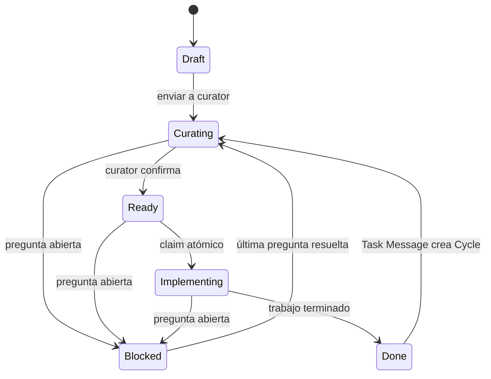

# 01 — Modelo de dominio

## 1. Convenciones

- Nombres de dominio y JSON: camelCase.
- Nombres SQL: snake_case.
- Fechas: UTC RFC 3339 con milisegundos, por ejemplo `2026-07-21T18:32:15.123Z`.
- IDs: prefijo + ULID en mayúsculas.
- Los enums JSON usan snake_case en minúsculas.
- Un string requerido no puede quedar vacío después de `trim()`.

## 2. Relaciones

```text
Project 1 ─── N Task
Task    1 ─── N Question
Task    1 ─── N Attachment
Task    1 ─── N TaskEvent
```

No existe Workspace como entidad. Una instalación representa un único workspace.

No existe Repository como entidad. Project contiene el inventario de su único repositorio.

## 3. Identificadores

| Entidad | Prefijo | Ejemplo |
| --- | --- | --- |
| Project | `prj_` | `prj_01K0ABC...` |
| Task | `tsk_` | `tsk_01K0ABC...` |
| Question | `qst_` | `qst_01K0ABC...` |
| QuestionOption | `opt_` | `opt_01K0ABC...` |
| Attachment | `att_` | `att_01K0ABC...` |
| TaskEvent | `evt_` | `evt_01K0ABC...` |

Los IDs:

- Se generan en Core mediante un puerto `IdGenerator`.
- No dependen de SQLite.
- No se reutilizan.
- Se exigen completos en API y CLI.

## 4. Project

```ts
type GitProvider = "github" | "azure_devops" | "gitlab" | "other";
type AccountScope = "personal" | "work";

interface Project {
  id: ProjectId;
  name: string;
  description: string;
  repositoryPath: string;
  gitProvider: GitProvider;
  accountScope: AccountScope;
  createdAt: string;
  updatedAt: string;
  archivedAt: string | null;
}
```

### Invariantes

- `name`: 1–120 caracteres tras trim.
- `description`: máximo 10 000 caracteres; vacío permitido.
- `repositoryPath`: ruta absoluta canonicalizada.
- Debe estar bajo uno de los roots configurados.
- Debe existir y contener un worktree Git válido.
- La ruta es única en toda la instalación, incluidos Projects archivados.
- `gitProvider` y `accountScope` son enums cerrados.
- Un Project archivado no se puede actualizar; primero debe restaurarse.
- Un Project solo se puede archivar si todas sus Tasks están archivadas.

### Repositorio Git válido

Se considera válido cuando, después de canonicalizar la ruta:

- Existe como directorio.
- Está bajo un root permitido.
- `git -C PATH rev-parse --is-inside-work-tree` devuelve `true`.

AIWS no valida en v0.1 que el remote corresponda a `gitProvider`.

## 5. Task

```ts
type TaskStatus =
  | "draft"
  | "curating"
  | "blocked"
  | "ready"
  | "implementing"
  | "done";

interface Task {
  id: TaskId;
  projectId: ProjectId;
  title: string;
  userRequest: string;
  curatorSpec: string;
  status: TaskStatus;
  prUrl: string | null;
  version: number;
  createdAt: string;
  updatedAt: string;
  archivedAt: string | null;
}
```

### Invariantes

- Pertenece a un Project existente y no archivado al crearla.
- `userRequest`: 1–100 000 caracteres tras trim; editable solo en Draft e inmutable desde Curating.
- `title`: 1–200 caracteres.
- Si se omite, se genera tomando la primera línea no vacía de `userRequest`, normalizando whitespace y truncando a 120 caracteres.
- `curatorSpec`: máximo 1 MiB UTF-8; comienza como string vacío.
- `prUrl`: null o URL HTTP/HTTPS absoluta de máximo 2 048 caracteres.
- `version`: comienza en 1.
- Una Task archivada es de solo lectura salvo para restaurarla.
- Toda mutación del agregado incrementa la versión exactamente una vez.

### Agregado Task

Forman parte del agregado:

- Task.
- Questions.
- Attachments.
- TaskEvents.

Project es una referencia externa, aunque `task show` incluya una proyección del Project.

## 6. Estados

### Draft

La persona solicitante prepara título, User Request y Attachments. Todavía no ha comenzado Curation.

### Blocked

Existe al menos una Question abierta. La Task espera información.

### Curating

La petición está congelada y un curator inspecciona el agregado, repositorio y adjuntos. En Projects gestionados puede haber un Run de curation activo.

### Ready

El curator ha confirmado explícitamente que puede implementarse.

Requiere:

- Curator Spec no vacía.
- Cero Questions abiertas.

### Implementing

Una persona o agente ha reclamado la Task.

### Done

El trabajo se considera terminado. No requiere PR.

## 7. Transiciones

### Transiciones explícitas

| Desde | Hacia | Precondiciones |
| --- | --- | --- |
| Draft | Curating | Project gestionado con Curation Agent Profile habilitado; sin requisito adicional en Project local |
| Curating | Ready | Spec no vacía y cero Questions abiertas |
| Ready | Implementing | Estado y versión esperados |
| Implementing | Done | Estado y versión esperados |

La transición explícita a Blocked no existe. Blocked se alcanza creando o reabriendo una Question.

### Transiciones automáticas conservadoras

| Evento | Desde | Hacia |
| --- | --- | --- |
| Crear/reabrir Question | Curating | Blocked |
| Crear/reabrir Question | Ready | Blocked |
| Crear/reabrir Question | Implementing | Blocked |
| Resolver la última Question abierta | Blocked | Curating |

Crear/reabrir una Question en Done se rechaza.

### Diagrama



## 8. Question

```ts
type QuestionType = "text" | "single_choice" | "multiple_choice";
type QuestionStatus = "open" | "answered" | "dismissed";

interface QuestionOption {
  id: QuestionOptionId;
  label: string;
  position: number;
}

interface Question {
  id: QuestionId;
  taskId: TaskId;
  text: string;
  type: QuestionType;
  options: QuestionOption[];
  allowOther: boolean;
  answerText: string | null;
  selectedOptionIds: QuestionOptionId[];
  status: QuestionStatus;
  createdAt: string;
  updatedAt: string;
  answeredAt: string | null;
  dismissedAt: string | null;
}
```

### Invariantes comunes

- `text`: 1–5 000 caracteres.
- Máximo 20 opciones.
- Cada label: 1–500 caracteres.
- IDs de opción únicos dentro de la Question.
- `position` consecutiva desde 0.
- Una Question no se elimina.
- Texto, tipo, opciones y `allowOther` se congelan después de la primera respuesta.

### Por tipo

#### text

- `options` debe ser `[]`.
- Al responder, `answerText` no vacío.
- `selectedOptionIds` debe ser `[]`.

#### single_choice

- Requiere entre 2 y 20 opciones.
- Al responder debe seleccionar exactamente una opción, salvo que use únicamente texto libre con `allowOther=true`.
- Puede incluir comentario adicional.

#### multiple_choice

- Requiere entre 2 y 20 opciones.
- Al responder debe seleccionar al menos una opción o aportar texto libre con `allowOther=true`.
- No admite IDs duplicados.

### Operaciones

#### Create

- Rechaza Task archivada o Done.
- Crea Question Open.
- Cambia Task a Blocked si no lo estaba.
- Incrementa Task.version una vez.
- Emite `question_created` y, si procede, `status_changed`.

#### Update

- Solo cuando `status=open` y `answeredAt=null`.
- Permite cambiar texto, tipo, opciones y allowOther.
- Revalida la Question completa.
- Incrementa Task.version una vez.

#### Answer

- Solo Open.
- Valida la respuesta según tipo.
- Cambia a Answered y establece `answeredAt=now`.
- Limpia `dismissedAt`.
- Si era la última abierta y Task estaba Blocked, cambia Task a Curating.

#### Dismiss

- Solo Open.
- Cambia a Dismissed y establece `dismissedAt=now`.
- Si era la última abierta y Task estaba Blocked, cambia Task a Curating.

#### Reopen

- Desde Answered o Dismissed.
- Conserva respuesta y timestamps históricos.
- Cambia a Open.
- Cambia Task a Blocked.
- No permite Done.

Una respuesta posterior sustituye el valor visible anterior y actualiza `answeredAt`; el TaskEvent conserva que ocurrió una nueva respuesta, no el texto completo anterior.

## 9. Attachment

```ts
interface Attachment {
  id: AttachmentId;
  taskId: TaskId;
  originalName: string;
  mimeType: string;
  sizeBytes: number;
  sha256: string;
  createdAt: string;
}
```

El DTO público no contiene `storageKey`.

### Invariantes

- Task activa y no archivada.
- Máximo configurable, por defecto 10 por Task.
- Máximo configurable, por defecto 25 MiB.
- Nombre original de 1–255 caracteres después de extraer únicamente el basename.
- Tipo/extensión permitidos.
- SHA-256 hexadecimal lowercase de 64 caracteres.
- `storageKey` generado por el servidor; nunca procede del usuario.

Eliminar un Attachment:

- Requiere versión esperada.
- Elimina metadatos y contenido mediante el protocolo seguro documentado.
- Incrementa Task.version.
- Emite `attachment_removed`.

## 10. TaskEvent

```ts
type ActorType = "web" | "cli" | "system";

interface TaskEvent {
  id: TaskEventId;
  taskId: TaskId;
  type: string;
  actorType: ActorType;
  metadata: Record<string, unknown>;
  createdAt: string;
}
```

### Tipos iniciales

- `task_created`
- `task_updated`
- `spec_updated`
- `status_changed`
- `question_created`
- `question_updated`
- `question_answered`
- `question_dismissed`
- `question_reopened`
- `attachment_added`
- `attachment_removed`
- `pr_url_updated`
- `task_archived`
- `task_unarchived`

### Reglas de metadata

- Incluye `taskVersion`.
- Los cambios de estado incluyen `from`, `to`, `automatic` y `reason` opcional.
- Spec updated registra longitud y SHA-256, no el contenido.
- Attachment registra ID, nombre, MIME y tamaño, no bytes ni storage key.
- No contiene secretos, cookies, token, password ni contenido completo de la petición/spec.

## 11. Concurrencia

Toda mutación del agregado recibe `expectedVersion`.

Dentro de una transacción:

1. Validar estado actual.
2. Ejecutar la mutación.
3. Actualizar Task con `WHERE version = expectedVersion`.
4. Incrementar exactamente a `expectedVersion + 1`.
5. Insertar todos los TaskEvents con esa nueva versión.
6. Commit.

Si el update afecta cero filas:

- Rollback.
- Error `version_conflict`.
- HTTP 409.
- No debe quedar fichero definitivo ni evento parcial.

## 12. Archivado

### Task

- Archive y unarchive requieren versión esperada.
- Archivar conserva estado, Questions, Attachments y Events.
- Una Task archivada no aparece en listados normales.
- Restaurar conserva el estado anterior.

### Project

- Se archiva sin borrado.
- Requiere cero Tasks activas.
- Restaurar no restaura Tasks.
# Extensión v0.2: Connections, Agent Profiles y Runs

Esta sección amplía la baseline v0.1 sin relajar sus invariantes.

- `Connection` identifica una instalación GitHub y su ciclo `active | revoked`; no contiene tokens.
- Un Project es `local` o `managed`. Solo el gestionado referencia Connection y metadatos remotos.
- `AgentProfile` selecciona runtime Codex, modo de autenticación y una referencia externa al secreto.
- `Run` es un attempt inmutable de identidad propia con estados `queued → preparing → running → publishing → succeeded`; los estados activos pueden terminar en `failed` o `cancelled`.
- Solo una Task Ready, no archivada ni pausada, de un Project automatizado elegible puede reclamarse.
- Claim crea Run y mueve Ready → Implementing dentro de una transacción.
- Terminar un Run muta la Task exactamente una vez: éxito a Done con PR; fallo/cancelación a Ready con pausa.
- Heartbeat vencido equivale a fallo y requiere retry manual versionado.
- La concurrencia se limita por Project y nunca autoriza dos Runs activos para la misma Task.

## Extensión v0.3: Curation y tipos de Run

- `Run.kind` es `curation | implementation`; `Run.outcome` es `ready | blocked | null`.
- Los attempts se numeran por `(taskId, kind)` y ambos kinds consumen `Project.maxConcurrency`.
- Un Run de curation no tiene branch y solo recorre `queued → preparing → running → succeeded|failed|cancelled`.
- El Run captura `Task.version`; un resultado obsoleto se descarta íntegramente.
- Un resultado Ready aplica título opcional y Curator Spec requerida. Un resultado Blocked aplica título/spec opcionales y entre 1 y 10 Questions.
- La aplicación estructurada, los eventos y la subida única de versión pertenecen a una sola transacción.
- Fallar curation mantiene Curating y pausa la automatización hasta Retry manual.

## Extensión v0.4: Task Cycle, mensajes y Delivery

```text
Task 1 ─── N TaskCycle 1 ─── N TaskMessage
TaskCycle 1 ─── N Question / Attachment / Run / SpecRevision
Question 1 ─── N QuestionAnswer
Task 1 ─── N Delivery 1 ─── N Run
```

IDs nuevos: `cyc_`, `msg_`, `spc_`, `ans_` y `dlv_`, siempre con ULID. Crear una Task crea Cycle 1 y su mensaje inicial. Un mensaje desde Done crea el siguiente Cycle de forma condicionada por `expectedVersion` y mueve a Curating; desde Blocked usa el Cycle activo y conserva estado y Questions. Los ciclos históricos y sus Questions no se mutan. Cada escritura de spec y cada respuesta crea un snapshot append-only.

Delivery contiene la rama y PR vigentes. Los Runs de implementation reutilizan su rama; `prUrl` es su proyección compatible en Task. Completar implementation marca el Cycle activo como completado.

La pausa de automatización pertenece al trabajo pendiente del Cycle vigente. Crear un Cycle desde
Done siempre la limpia: un fallo de una Delivery o Cycle anterior no puede impedir su curation.
En Curating o Ready, `resumeAutomation(expectedVersion)` limpia una pausa de forma explícita,
incrementa la versión exactamente una vez y se rechaza si existe un Run activo.

## Recuperación de Runs v0.4

- `Run.executionStage` separa `agent` de `publishing`; entrar en publishing confirma que Codex terminó y deja un checkpoint recuperable.
- `Run.resumeFromRunId` enlaza un Retry de publicación con el attempt cuyo workspace debe verificarse.
- Retry admite `auto | full | publish_only`. Auto solo elige publicación cuando existen etapa publishing y `baseSha`; la ausencia, suciedad o divergencia del workspace impide publicar y exige Retry completo.
- Cancelar termina el Run y devuelve la Task a Ready en la transacción existente; el manager observa el terminal y detiene el contenedor identificado por Run.
- Retry o Resume manual son las únicas formas de limpiar una pausa dentro del mismo Cycle.

## Catálogo de modelos y reasoning effort

`AgentProfile` añade `reasoningEffort: string | null`. Los perfiles nuevos requieren `model` y
`reasoningEffort`; el modelo debe existir en el catálogo vivo de la credencial y el effort debe
pertenecer a `supportedReasoningEfforts`. Ambos se conservan como strings para admitir niveles
futuros anunciados por Codex. Los null solo representan perfiles legacy y no se rellenan durante
la migración.

## Notificaciones globales v0.5

Notification Settings es configuración singleton de infraestructura, no parte del agregado Task.
Cada TaskEvent `status_changed` confirmado puede proyectarse a una fila de outbox con el mismo
`eventId`. La fila contiene snapshots de Project/Task, estados anterior/nuevo y generación de
configuración; nunca petición, spec, respuestas, motivos o secretos.

Insertar TaskEvent y outbox pertenece a la misma transacción. Con notificaciones desactivadas no se
inserta outbox ni se realiza backfill posterior. Cambiar activación, URL, topic o token incrementa
la generación y elimina pendientes anteriores. El dispatcher no muta Task ni TaskEvent.

## Perfiles de agente por fase — Hito 21

`Project.curationAgentProfileId` y `Project.implementationAgentProfileId` son referencias
independientes y nullable. Pueden apuntar al mismo Agent Profile, pero ningún campo hereda o usa el
otro como fallback.

Un Project gestionado exige un perfil de Curation existente y habilitado para Draft → Curating.
Activar Implementation exige un perfil de Implementation existente y habilitado. Claim y Retry
seleccionan la referencia según `Run.kind`; el Run copia el ID a `Run.agentProfileId` y esa copia
permanece histórica. Los Runs queued no se reconfiguran al editar el Project.

Cron y timezone pertenecen únicamente a Implementation. `maxConcurrency` sigue limitando de forma
conjunta Runs activos de ambos kinds.

## Rama de referencia por Delivery — Hito 22

`Project.defaultBranch` es una preferencia mutable para Tasks futuras. En un Project gestionado es
obligatoria; un Project local no la admite.

Al crear una Task gestionada se crea también su Delivery. `Delivery.baseBranch` captura la rama
seleccionada, o la preferencia del Project si no hubo selección explícita. Ese snapshot no cambia
al editar el Project y gobierna el checkout inicial, Curation, Implementation y la base de la Pull
Request. La rama de trabajo continúa siendo `Delivery.branchName`.

## Connections gestionadas — Hito 24

`Connection` es una unión discriminada por `provider`. GitHub conserva `installationId`; Azure
DevOps conserva `organizationId` y `organizationName`. Los estados comunes son `active`,
`reauthorization_required` y `revoked`.

Un Project gestionado deriva `gitProvider` de su Connection. Su `remoteRepositoryId` conserva el
identificador remoto sin reinterpretarlo: decimal para GitHub o UUID para Azure. El nombre completo
Azure es `projectName/repositoryName`. Las credenciales OAuth y access tokens no pertenecen al
dominio ni se exponen en DTOs.
