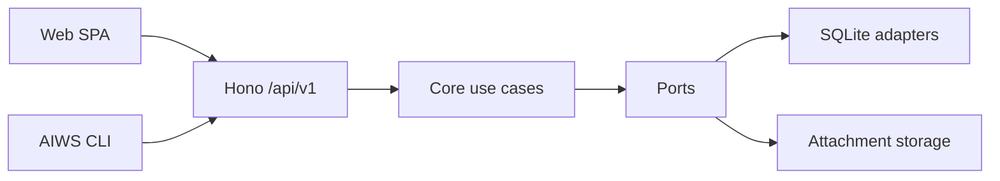
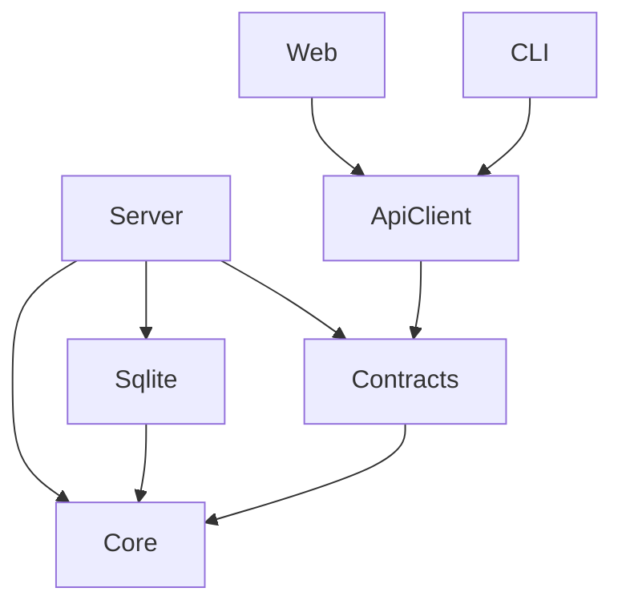

# 02 — Arquitectura

## 1. Vista general



Web y CLI son clientes no privilegiados. Solo Server compone Core e infraestructura.

## 2. Stack

| Capa | Tecnología |
| --- | --- |
| Runtime/package manager | Bun |
| Monorepo | Bun Workspaces |
| API | Hono |
| Validación | Zod |
| Contrato | OpenAPI 3.1 |
| Base de datos | `bun:sqlite` |
| Web | React + Vite |
| Router | TanStack Router |
| Server state | TanStack Query |
| Formularios | React Hook Form + Zod |
| UI | Tailwind CSS + shadcn/ui |
| CLI | Commander |
| Cliente API | openapi-fetch |
| Tipos API | openapi-typescript |
| Formato/lint | Biome |
| Tests | bun test |
| Typecheck | tsc |

## 3. Estructura

```text
apps/
  server/
    src/
      auth/
      http/
      middleware/
      composition/
      config.ts
      index.ts
  web/
    src/
      routes/
      features/
      components/
      lib/
  cli/
    src/
      commands/
      output/
      config.ts
      index.ts

packages/
  core/
    src/
      domain/
      use-cases/
      ports/
      errors/
  contracts/
    src/
      schemas/
      openapi/
  sqlite/
    src/
      repositories/
      storage/
      migrations/
      database.ts
  api-client/
    src/
      generated/
      client.ts

docs/
```

No crear `packages/shared`.

## 4. Dependencias permitidas



Restricciones:

- Core no depende de ningún otro paquete interno.
- SQLite implementa ports definidos por Core.
- Contracts puede importar enums/tipos puros de Core, pero Core no importa Zod.
- API Client contiene tipos generados; no importa Server.
- Web y CLI no importan Core ni SQLite.
- Server es composition root.

## 5. Core

### Puertos

```ts
interface Clock {
  now(): Date;
}

interface IdGenerator {
  projectId(): ProjectId;
  taskId(): TaskId;
  questionId(): QuestionId;
  optionId(): QuestionOptionId;
  attachmentId(): AttachmentId;
  eventId(): TaskEventId;
}

interface UnitOfWork {
  execute<T>(work: (stores: Stores) => Promise<T>): Promise<T>;
}

interface Stores {
  projects: ProjectStore;
  tasks: TaskStore;
  questions: QuestionStore;
  attachments: AttachmentMetadataStore;
  events: TaskEventStore;
}

interface AttachmentBlobStore {
  stage(input: ReadableStream, limits: UploadLimits): Promise<StagedBlob>;
  commit(staged: StagedBlob, storageKey: string): Promise<void>;
  open(storageKey: string): Promise<ReadableStream>;
  quarantine(storageKey: string): Promise<QuarantinedBlob>;
  restore(blob: QuarantinedBlob): Promise<void>;
  purge(blob: QuarantinedBlob): Promise<void>;
  discard(staged: StagedBlob): Promise<void>;
}
```

Los ports usan tipos de dominio, no filas SQL ni objetos Hono.

### Casos de uso

Projects:

- CreateProject
- ListProjects
- GetProject
- UpdateProject
- ArchiveProject
- UnarchiveProject

Tasks:

- CreateTask
- ListTasks
- GetTaskAggregate
- UpdateTask
- TransitionTask
- ArchiveTask
- UnarchiveTask
- ListTaskActivity

Questions:

- CreateQuestion
- UpdateQuestion
- AnswerQuestion
- DismissQuestion
- ReopenQuestion

Attachments:

- AddAttachment
- GetAttachment
- OpenAttachmentContent
- RemoveAttachment

Cada caso de uso:

- Recibe un input tipado.
- No conoce HTTP.
- Devuelve un output tipado.
- Lanza únicamente errores de dominio conocidos.
- Es testeable con ports fake.

## 6. Errores de dominio

| Error | HTTP | Código API |
| --- | ---: | --- |
| ValidationError | 422 | `validation_error` |
| NotFoundError | 404 | `not_found` |
| AuthenticationError | 401 | `unauthorized` |
| ForbiddenError | 403 | `forbidden` |
| VersionConflictError | 409 | `version_conflict` |
| InvalidTransitionError | 409 | `invalid_transition` |
| ProjectHasActiveTasksError | 409 | `project_has_active_tasks` |
| LimitExceededError | 413/422 | `limit_exceeded` |
| UnsupportedMediaTypeError | 415 | `unsupported_media_type` |
| StorageError | 500 | `storage_error` |

Errores inesperados se convierten en `internal_error`, se loguean con request ID y no exponen stack al cliente.

## 7. Transacciones

Una operación que cambia el agregado Task:

- Abre una única transacción SQLite.
- Valida expectedVersion.
- Persiste cambios de Task/Question/Attachment metadata.
- Incrementa Task.version una vez.
- Inserta eventos.
- Hace commit.

Los blobs requieren coordinación adicional:

### Añadir

1. Stage fuera de la transacción.
2. Validar y calcular hash.
3. Abrir transacción y revalidar versión/límites.
4. Mover blob a ubicación definitiva.
5. Insertar metadata, actualizar Task e insertar eventos.
6. Commit.
7. Si falla 4–6, limpiar blob y rollback.

### Eliminar

1. Comprobar metadata y versión.
2. Mover blob a cuarentena.
3. Transacción: eliminar metadata, actualizar Task, insertar evento.
4. Commit.
5. Purgar cuarentena.
6. Si falla la transacción, restaurar blob.

Un barrido de inicio elimina temporales y cuarentenas huérfanos con antigüedad superior al umbral configurado.

## 8. API

- Prefijo `/api/v1`.
- JSON camelCase.
- Validación en frontera.
- Error envelope uniforme.
- Request ID en respuesta.
- ETag de Task igual a su versión.
- `If-Match` obligatorio en mutaciones del agregado.
- OpenAPI generado desde schemas/rutas.

## 9. Web

SPA estática servida por Server.

No contiene lógica de dominio. Gestiona formularios, presentación, cache e interacción.

Los conflictos 409:

- No se reintentan automáticamente.
- Muestran que la Task cambió.
- Conservan la edición local.
- Permiten copiarla o recargar la versión actual.

## 10. CLI

Binario HTTP-only.

- Commander para parsing.
- openapi-fetch para contrato.
- `--json` sin prompts.
- stdin/ficheros para textos largos.
- streams para Attachments.
- mapping explícito de HTTP/errors a exit codes.

## 11. Proceso servidor

Orden de arranque:

1. Cargar y validar configuración.
2. Crear directorios de datos con permisos seguros.
3. Abrir SQLite.
4. Aplicar pragmas.
5. Ejecutar migraciones.
6. Limpiar temporales huérfanos.
7. Construir adapters y use cases.
8. Empezar a escuchar.

Si configuración o migración falla, el proceso termina con error y no abre el puerto.

Orden de apagado:

1. Dejar de aceptar conexiones.
2. Esperar requests activos con timeout.
3. Cerrar SQLite.
4. Terminar.

## 12. Decisiones descartadas

- ORM en v0.1.
- RPC como contrato público.
- SSR/framework full-stack.
- Acceso directo de CLI a Core/SQLite.
- Múltiples servicios.
- DI container.
- Event sourcing.
- Generic CRUD service.
- Repository entity.

## 13. Addendum v0.3 — manager de curation

El manager reclama primero Runs queued y después Tasks gestionadas Curating o Ready. Para curation prepara un worktree detached montado read-only, materializa Attachments en otro mount read-only y ejecuta Codex con un output schema discriminado. El contenedor no muta AIWS: devuelve JSON al manager, que invoca el caso de uso system-only y aplica todo en SQLite mediante la Unit of Work.

Task Status expresa negocio; Run Kind expresa el propósito técnico del attempt. Ambos tipos de Run comparten perfiles y concurrencia, pero solo Implementation usa rama, publishing y pull request.

## 14. Addendum v0.4 — hilo incremental

Core añade stores y casos de uso explícitos para Cycles, Messages, Spec Revisions, Question Answers, Deliveries y Timeline. La API de mensajes coordina staging de todos los ficheros antes de una única Unit of Work; ante rollback compensa todos los blobs. El runner recibe el historial completo y prepara curation sobre el ref de Delivery que usará implementation.

## 15. Catálogo Codex

Server expone `POST /api/v1/agent-profiles/model-catalog` y llama por la red Docker interna al
endpoint de control del runner-manager. Este endpoint usa un secreto dedicado y comparación
constante. El runner inicia un agente efímero restringido, negocia JSON-RPC con
`codex app-server`, pagina `model/list`, normaliza el resultado y mantiene una caché corta por
modo/referencia. La integración queda aislada en un adapter para absorber cambios del protocolo
experimental.

## 16. Estado operativo del runner

Server mantiene en memoria el instante de la última petición system autenticada del runner. Expone
una proyección `unknown | online | offline`; no persiste heartbeats ni confunde disponibilidad del
proceso con el estado de una Task. El umbral offline es 45 segundos, por encima del claim periódico.
Web solo puede refrescar esta proyección y ejecutar `resumeAutomation` sobre Tasks pausadas. No se
expone control de Docker: reiniciar un manager detenido exigiría dar al Server una autoridad nueva
sobre el socket y, además, no podría depender del propio manager detenido.

## 17. Notificaciones ntfy

El adapter SQLite de TaskEvent está decorado para insertar la outbox de cada `status_changed`
cuando la configuración global está activa. El dispatcher vive dentro de Server y es posterior al
commit: arranca inmediatamente, consulta cada cinco segundos, entrega hasta 20 filas con
concurrencia cuatro y usa requests de diez segundos sin redirects.

El apagado deja de hacer polling, espera los envíos activos y solo después cierra SQLite. Core no
importa ntfy, HTTP, cifrado ni tipos de configuración. La outbox persistente es la frontera que
mantiene la disponibilidad de ntfy fuera del workflow.

## 18. Resolución de Agent Profile por Run kind

Project mantiene dos referencias explícitas. El caso de uso de claim y Retry elige
`curationAgentProfileId` para Curation e `implementationAgentProfileId` para Implementation. Al
crear el Run copia la referencia elegida a `Run.agentProfileId`; la ejecución de un Run queued lee
ese snapshot, no vuelve a consultar la configuración del Project. Cron continúa evaluándose solo
para Implementation y la cuenta de concurrencia permanece conjunta.

## 19. Base Branch y refs remotos

Server encapsula el listado de ramas tras `GitHubAppGateway`; Web y CLI solo consumen HTTP. Core
captura la selección en Delivery sin importar GitHub. El runner mantiene el mirror como cache:
fetch escribe exclusivamente `refs/remotes/origin/*`, resuelve desde allí el ref preferido y usa
`refs/heads/*` solo para ramas de trabajo. Esta separación evita actualizar una rama checkout por
un worktree enlazado.

## 20. Distribución v0.5.1

El checkout conserva `compose.yaml` como entorno de desarrollo con `build:`. La distribución usa
un Compose distinto que referencia tres imágenes GHCR: `aiws`, `aiws-runner-manager` y
`aiws-agent`. Server y manager son servicios persistentes; la imagen agent es una dependencia de
ejecución del manager.

El binario `aiws` no forma parte del ciclo de instalación del stack. Vive en el host y accede
exclusivamente por HTTP. Agentes externos tampoco forman parte del Compose: compartir el CLI y su
configuración Unix no amplía la autoridad de AIWS sobre sus procesos, sandboxes o políticas.

## 21. Providers Git gestionados

Server resuelve un `ManagedGitProvider` por `Connection.provider`. La interfaz cubre repositorios,
ramas, credenciales Git y publicación idempotente de pull requests. GitHub App y Azure DevOps son
adapters; Hono no selecciona endpoints de provider para operaciones compartidas.

La autorización inicial permanece en módulos específicos. Azure OAuth, cifrado y caché de tokens
son infraestructura Server/SQLite y no entran en Core. El runner recibe una unión system-only de
credenciales basic/bearer y configura Git sin interpolar secretos.
